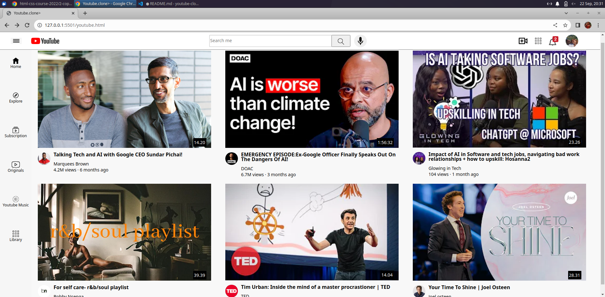

# Youtube-clone

This is my first project where I decided to create a replica of youtube.

**Creation
I used HTML and CSS when creating this youtube clone.

**What this youtube clone entails?**
I have used some CSS techniques such as Flex Box, Tooltips( which can be seen for every icon on header except the Profile),
